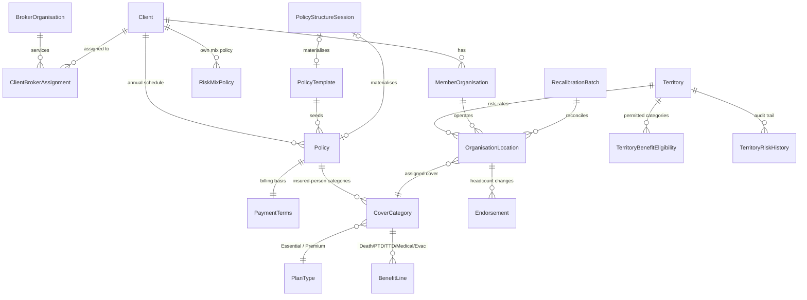

# Africa Risk Map Platform for GRAA and future clients (Insurer / Broker / Client)

> Source-of-truth product/architecture plan, captured in full from the planning session. `.cursor/rules/90-project-context.mdc` summarises the parts most relevant to day-to-day agent work; this document is the detailed reference behind that summary.

## Source data reviewed

- `LHR - Risk Rating Table - All Africa GRAA Members (v3) (25-05-2026).xlsx` — 62 territory rows: country/sub-region, GRAA presence flag, # PPL (country-level headcount only), 6 risk sub-scores (Healthcare Infrastructure, Medical Personnel, Medical Transport, Emergency Response, Security/Conflict, Occupational Hazards), Total Score, Risk Category (Low/Medium/High/Very High/Extreme), evacuation paths, LHR evac cost estimate, Benefit Options Available (1-2 / 3-4 / 4 only / Decline), context notes. Sheet2 is the rating engine: assumes a covered-lives mix across tiers (currently ~85% Low/Med, 10% High, 5% V-High) and burn-cost math (Death/PTD/TTD/Meds) that produces the flat pppm rates.
- `GRAA - Monthly Premium & Agg Calc (2025-2026).xlsx` — month-by-month aggregate ledger (Essential Cover, Premium Cover tabs) of member count, monthly premium, monthly agg, annual agg, moved by endorsement rows (adds/removals). Confirms current rates: Essential R24.06 premium / R35.00 agg; Premium (min. entry) R77.44 premium / R112.44 agg. As of Jun-26: 6,503 Essential + 14 Premium members.
- Policy schedule extract (image) — confirms the 2025-2026 rate card as currently on-risk: Category 1 (Essential Cover) Premium R288.75 incl VAT p.a. (R24.06 pm) / Aggregate Excess R420 excl VAT p.a. (R35.00 pm); Category 3 (Premium Cover) Premium R929.25 incl VAT p.a. (R77.44 pm) / Aggregate Excess R1,349.25 excl VAT p.a. (R112.44 pm).

Key gap: neither file has a per-organisation or per-location register — only country-level totals and an aggregate ledger. Per confirmation, a Recalibration Wizard is built as the first operational step to reconstruct that missing layer.

## Policy structure clarified

GRAA's policy renews annually on 1 December, running 12-month terms. The rates labelled "2026" in the ledger workbook are actually the 2026-2027 policy year rates (i.e. effective from the Dec-2026 renewal), not calendar-2026.

Two rate cards are calibrated side by side:

- **2025-2026** (current, on-risk until 30 Nov 2026): Category 1 (Essential) R24.06 premium / R35.00 agg; Category 3 (Premium) R77.44 premium / R112.44 agg.
- **2026-2027** (from 1 Dec 2026): Category 1 (Essential) R24.00 premium / R40.50 agg; Category 2 (Premium — renumbered from Category 3) R78.00 premium / R130.50 agg.

VAT treatment differs by component and must be modelled explicitly: Premium is quoted incl. VAT, Aggregate Excess is quoted excl. VAT. Each CoverCategory stores its premium and aggregate rate lines with their own VAT flag (assuming standard 15% SA VAT unless advised otherwise) so displayed/calculated figures reconcile exactly with the policy schedule.

Cover "Category" labels (1, 2, 3) are policy-year-specific display labels on CoverCategory, mapped onto the underlying PlanType (Essential/Premium) — versioned per Policy (e.g. Category 3 → Category 2 at the 2026-2027 renewal) rather than hard-coded, so future renumbering doesn't require a schema change.

Assumption (flag if wrong): the earlier historical terms seen in the ledger workbook (2022-2023, 2023-2024, 2024-2025) also load as historical Policy records for a complete audit trail — the per-term Policy model supports this at no extra cost.

## Confirmed direction

- Full scope, phased delivery: risk map, org/employee/location tracking, PA risk inputs, premium & aggregate calculator.
- Three roles: Insurer (Human Risks/Lombard, full admin), Broker (manage clients, full visibility), Client (GRAA, view-only + submit new-business requests on their own data).
- Modern recommended stack (no existing infra constraint — workspace is empty/greenfield).
- Seed the platform from both workbooks; reconcile organisation/location detail via the Recalibration Wizard.
- Multi-client, multi-broker from day one: the platform must support other association clients beyond GRAA (potentially with similar risk exposure), each with its own broker and its own scoped Africa Risk Map view.

## Explicitly out of scope

Confirmed as not needed for this tool (raised during the gap review, then declined):

- Claims management — no claims register, claim status tracking, or claims-ratio feed into risk scoring.
- Invoicing & payment reconciliation — the platform computes premium/aggregate figures but does not track invoicing, debtor/arrears status, or bank-receipt reconciliation.
- Deeper SA insurance compliance beyond POPIA — no FAIS conduct-of-business features, no binder-function analysis/registration workflow, no Policyholder Protection Rules tooling. POPIA (data classification, retention, anonymization) remains a first-class requirement as already scoped.
- Certificates of insurance / Policy Schedule PDF generation — not built. The brand spec captured in "Document & Policy Schedule design" is reference material only, kept in case this changes later, not an active or planned phase.

## Multi-client & multi-broker design

GRAA is the first client, but the model is built so a second client (different broker, different book) plugs in cleanly:

- **BrokerOrganisation** becomes a first-class entity (e.g. Lombard's own brokerage, or a third-party broker), separate from the Insurer. User records with role BROKER belong to a BrokerOrganisation, not directly to a client.
- **ClientBrokerAssignment** (join table, clientId + brokerOrganisationId, with an effective date) links each Client to the broker servicing it. This supports a broker change at renewal without losing history, and allows co-broking if ever needed.
- Scoping stays client-first, broker-second: a Broker user can only see the clients their BrokerOrganisation is assigned to (via ClientBrokerAssignment), never another broker's clients. Insurer users see all clients across all brokers. Client users see only their own Client.
- The Territory risk register (country risk scores) stays a single shared source of truth maintained by the Insurer — no duplication of risk research per client — but everything client-specific is scoped by clientId:
  - MemberOrganisation / OrganisationLocation (already client-scoped).
  - Policy (and its CoverCategory / BenefitLine / PaymentTerms) is per-client (two clients with similar exposure can still have different categories, benefits, rates and billing bases; a policy can be cloned as a starting template for a new client or a renewal).
  - RiskMixPolicy gains a clientId (each client's book has its own target mix/tolerance banding, since it's calibrated off that client's own territory footprint).
  - RecalibrationBatch is already per-client.
- The map view becomes a client-scoped lens over the shared Territory data: the choropleth/base risk layer is global, but the organisation/location pins, headcount rollups, and premium summary shown are filtered to the active client context. Insurer/Broker users with access to more than one client get a client switcher in the nav; Client users are locked to their own client with no switcher.

## Build methodology & governance (from cursor-guardrails)

This project is scaffolded from the [AGM82/cursor-guardrails](https://github.com/AGM82/cursor-guardrails) template (GitHub "Use this template"), so the 7-tier guardrail system is present from the first commit rather than retrofitted. What that gives us on day one:

- **Tier 0 Workflow** — Plan Mode, plans in `.cursor/plans/` (this plan).
- **Tier 1 Advisory** — `.cursor/rules/*.mdc` + `AGENTS.md`; `90-project-context.mdc` is filled in (app description, domain glossary, canonical files, architecture, and the POPIA Data classification section) and stack deviations are noted in `30-react-stack.mdc`.
- **Tier 2 Toolchain** — TypeScript strict, ESLint (security + jsx-a11y), Prettier, commitlint (Conventional Commits), Vitest with enforced coverage (lines ≥80%, functions ≥80%, branches ≥70%).
- **Tier 3 Runtime** — Cursor hooks that block destructive shell commands + secret-file reads and write an audit log.
- **Tier 4 Automation** — Husky pre-commit (lint-staged + gitleaks) and CI (typecheck, lint, test, build, npm audit, SBOM, build-provenance attestation, gitleaks, Semgrep OWASP SAST); branch protection on main requiring the CI checks.
- **Tier 5 Workflows** — `/review`, `/audit`, `/pr`, `/update-deps`, `/guardrail-upgrade` slash commands; `/guardrail-upgrade` keeps this repo current as the template evolves.
- **Tier 6 Review** — Agent Review + Bugbot on PRs, TDD for logic-heavy work (the premium engine and geofencing are exactly this).
- Risk tier: given this platform handles personal information (insured persons/employees) and does financial calculation, treat it as **High risk** in the template's model → adopt guardrail layers 1-6. This is also why the governed-feeds/AI design stays advisory and audited.
- POPIA is a first-class requirement (SA personal-accident data): minimum-necessary collection, never log PII, no real client data in the repo, parameterised queries only, server-side authorization on every protected operation, and a documented retention/deletion path — all enforced by `10-security-popia.mdc` + `61-database.mdc`.

## Recommended tech stack

Aligned to the guardrails template's standardised stack; deviations are called out and recorded in `90-project-context.mdc`.

- React 19 + TypeScript (strict) with Tailwind CSS v4 + shadcn/ui + Lucide — the template's foundational UI tier (kept as-is).
- **App framework** — Next.js App Router (React 19 = Next.js 15) as a single full-stack codebase (UI + route handlers + server actions), built with a portable/containerized deployment target (see "Hosting" below — Cloud Run for build/testing, with production host TBD between a Lombard-owned Cloud Run project and Vercel Pro). This is a documented Tier-3 build/routing deviation from the template's Vite default, recorded with its rationale in `90-project-context.mdc` (full-stack needs: PostGIS spatial queries, server-side multi-tenant scoping, scheduled feed/AI jobs, premium engine). The entire 7-tier guardrail governance stays intact; only the build tool and routing change from the template baseline.
- Zod for validation at every trust boundary, TanStack Query for server state, TanStack Table for dense/sortable/filterable/virtualized data views, React Hook Form (+ `@hookform/resolvers`) for forms — the template's functional tier; directly suits the premium calculator, recalibration forms, and ledger/endorsement tables.
- shadcn Command (Radix + cmdk) for the global ⌘K command palette (entity search + actions across Clients/Territories/Organisations/Policies) — see "Design & UX direction."
- PostgreSQL + PostGIS (+ h3/pgrouting) with Prisma ORM, hosted on Neon (Azure Database for PostgreSQL is the Microsoft-estate alternative). Prisma is the chosen ORM (recorded per `61-database.mdc`); all schema changes are tracked migrations, FKs get explicit delete/update policies, multi-step writes are transactional. PostGIS is the spatial engine (see "Mapping & geospatial architecture"). Postgres Row-Level Security (RLS) policies keyed on clientId (and brokerOrganisationId for broker-scoped tables) are added as defense-in-depth underneath Prisma's application-level scoping, so a missed where clause cannot leak one client's data to another. Neon's pooled connection string is used for the app runtime (serverless-safe) with the direct/unpooled URL reserved for migrations, per the known Prisma+serverless connection-exhaustion pitfall. (If production moves to Cloud SQL, local/build-phase development can still point at a free Neon branch or a local Dockerized Postgres+PostGIS — both speak standard Postgres wire protocol, so switching the underlying host later is a standard `pg_dump`/restore, not a schema or query rewrite.)
- Clerk for authentication — the platform is self-contained (not integrated with Lombard's in-house Microsoft/Entra ecosystem), and at this user scale (roughly 2-3 Insurer, 1-2 Broker, 2-3 Client users) Clerk's free tier (up to 10,000 MAU) makes cost a non-issue, so this is the guardrails template's own default, not a deviation. Login is email OTP/magic-link only (no passwords to leak or forget); Google/Microsoft sign-in can be toggled on later with minimal effort if wanted, since that's a simple OAuth "sign in with" button, not full Enterprise SSO/SAML. Clerk handles identity/session only — role (INSURER_ADMIN/BROKER/CLIENT) and scope (clientId/brokerOrganisationId) are stored as Clerk user metadata, carried into a custom session-token claim, and are what the app's Postgres RLS policies and Prisma query scoping actually key on; Clerk's own data footprint is limited to login identity (email, name) — no insured-person or financial data ever reaches it. User administration (invite/deactivate, role and scope assignment, access-change audit log) is built on Clerk's Backend API rather than a self-built invite system.
- MapLibre GL JS (via react-map-gl) + deck.gl for the map; Recharts for trend charts (both recorded as project additions in `90-project-context.mdc`).
- Anthropic API as the AI provider for both governed AI features (Structure Chat, news monitoring) — a documented Tier-3 AI-tooling addition per `50-ai-tooling.mdc`, evaluated against its rejection criteria (data retention/deletion terms and a data processing agreement to be confirmed before any client personal data reaches a prompt; the retrieval-grounded/extractive design in both features already minimizes what's sent).
- Inngest for scheduled and background jobs (external feed fetches, AI news-scan runs, any future long-running import) — keeps cron-style work durable and out of the request path regardless of host, and sidesteps Vercel's serverless function timeouts if that's ever the deployment target.
- Sentry for error tracking and performance monitoring, wired to unhandled exceptions/promise rejections per `62-deployment-observability.mdc`; structured JSON logs carry a correlation/request ID threaded from the edge through every log line.
- Vitest + Testing Library for unit/component tests (template default, incl. `expectNoA11yViolations()` axe-core checks per new component per `31-design.mdc`); Playwright added for end-to-end coverage of critical multi-role flows (login/role-switch, recalibration wizard, premium calculator, AI Structure Chat confirm). Contract-first API shapes with consistent error envelopes (`{ error: { code, message, details?, requestId } }`) per `60-backend-api.mdc`.
- API shape: Next.js Route Handlers (`/api/v1/...`) for anything needing versioning, rate limiting, or external/future integration (imports, the two AI endpoints, webhooks); Server Actions for internal form mutations. Mutating endpoints that can be retried (endorsement submission, AI-draft confirmation, premium recalculation) accept an idempotency key. Lists that can grow past a few thousand rows (Endorsements, cross-client rollups, ExternalSignals) use cursor-based pagination. AI endpoints and any authenticated-but-untrusted routes carry a rate limit.
- **Hosting direction** — Google Cloud is now the likely production target (Lombard IT would probably want this inside its existing GCP environment eventually), with Vercel as the fallback if that doesn't firm up.
- **Build/testing phase** — confirmed: Cloud Run on a personal GCP account, using its genuine, permanent Always Free tier (2M requests/month, 180K vCPU-seconds, 360K GiB-seconds — indefinite, not a trial). The database stays on Neon's free tier rather than Cloud SQL during this phase, since Cloud SQL has no perpetual free tier (only a 30-day trial instance, then normal billing applies) — same Postgres+PostGIS engine either way, so nothing is lost by deferring Cloud SQL to a real production decision. Basemap tiles stay on Cloudflare R2 (also permanently free, no billing-account friction) rather than Cloud Storage. Note: GCP requires a billing account (card on file) attached even for some free-tier services (e.g. Cloud Storage) as an anti-abuse measure as of 2026 — no charge while within free-tier limits, but expect to be asked for one.
- **Hard requirement before go-live**: this is currently a personal GCP account, which is fine for build/testing but must not remain the permanent home for a production tool holding POPIA-relevant client/insured-person data. Ownership must move to a Lombard-owned GCP project/billing account before real client data enters the system.
- **Production hosting candidates**:
  - Google Cloud Run (runs the Next.js app as a standard Node.js container — no restricted-runtime friction the way Cloudflare Workers has for Prisma/PostGIS) on a Lombard-owned GCP project/billing account + Cloud SQL for PostgreSQL (PostGIS-capable, replacing Neon now that real usage justifies its cost) + Cloud Storage (replacing R2 for basemap tiles, optional) + Secret Manager — the leading candidate, since the app is already built and tested against Cloud Run; production is then mostly a matter of redeploying the same container into a properly-owned project, migrating the database, and tightening IAM/secrets.
  - Vercel Pro ($20/seat/month, required once this is genuinely in business use) + Neon (PostGIS) + Cloudflare (DNS/WAF/CDN) + R2 (basemap tiles) — the fallback path, if the GCP-ownership move doesn't materialise.
  - Built for portability either way: the app uses Next.js's official `output: 'standalone'` container build and ships a Dockerfile (satisfying the guardrails' own containerization rule in `62-deployment-observability.mdc` regardless of which host is chosen) — Vercel deploys straight from git and ignores the Dockerfile, Cloud Run consumes it directly. Vercel-proprietary conveniences (zero-config Image Optimization, edge-distributed Middleware, git-based preview URLs) are avoided or kept swappable so neither is a rework if the destination changes. Clerk (auth) and Inngest (background jobs) are host-agnostic SaaS services already and need no changes under either path.
- Staging and production are kept separate with separate secrets regardless of host, per `62-deployment-observability.mdc`; every deploy supports rollback to the prior artifact, and migrations shipped alongside a deploy stay backward-compatible with the previous app version for one deploy cycle.
- One-off import scripts (exceljs) to parse both workbooks into seed data for Prisma, plus loaders for geoBoundaries/OurAirports/healthsites.io/GeoNames.

## Design & UX direction

This is built on the Human Risks Brand System Manual (v2.0) as the authoritative source — not generic best-practice invention. Where the brand manual is silent on a product-specific decision, it's supplemented with researched B2B/geospatial UX patterns, clearly marked as such.

### Brand foundation (from the Human Risks Brand System Manual)

- **Colour** — a strict two-colour system, not an invented palette: Indigo Blue `#1D1146` (Pantone 2765C) for backgrounds, primary text, and structural elements ("The Stage" — authority and depth); Human Pink `#D30C55` (Pantone 7636C) reserved strictly for primary calls-to-action and high-priority active states ("The Spotlight" — vitality/urgency, the brand's "digital heartbeat"); Clean White `#FFFFFF` as the canvas. Pink is used for exactly the moments the brand names — "Pay Now," "Submit Claim," "Confirm Coverage"-equivalent actions in this app (Confirm endorsement, Confirm AI-drafted policy, Approve underwriting gate) and critical alerts/deadline warnings (renewal due, aggregate fund depleted, underwriting gate blocking) — never for navigation or secondary actions, which stay Indigo or neutral. Overusing Pink dilutes it, per the manual's own explicit warning.
- Data-visualisation tints are defined, not improvised: Indigo and Pink each have a fixed 100/80/60/40/20% tint scale for charts — used for the premium/aggregate trend charts and cross-client rollup visuals in the Dashboards phase. No arbitrary opacities.
- **Typography**: DIN 2014 (Bold) for headlines and "punch numbers" only (e.g. a dashboard's headline premium total, a big percentage) — never body copy, per the manual. Open Sans (Regular/Bold) for everything functional: body text, forms, tables, all web/app content — this is the actual workhorse font for the dense data views (Endorsements, Territory tables, Policy Schedules). Action item: confirm a webfont licence for DIN 2014 is in place (it's a commercial font); Open Sans is free via Google Fonts, so no blocker there.
- "The Analyst" dashboard mode is the mandated default (brand manual §3.4): clean white backgrounds, strict grids, data-focused layouts (80% data / 20% visuals) — this replaces any dark-console-by-default approach. Dark mode is offered as an opt-in secondary toggle rather than the default, and — conveniently — Indigo Blue already reads as "used for backgrounds" in the brand's own colour description, so a dark theme built around an Indigo canvas (instead of Indigo-on-white text) is a natural, on-brand variant rather than an off-brand invention.
- Forms, per the manual: Indigo focus ring on field click; dropdown/select inputs preferred over free text to prevent user error; multi-step flows (Recalibration Wizard, AI Structure Chat) use a horizontal progress bar with an Indigo track and Pink fill.
- Depth from light-grey dividers and strict grids, not heavy grid-lines or drop shadows — matches the manual's Policy Schedule guidance ("light grey lines for table dividers, avoid heavy grid lines") extended app-wide to every dense table.

### Risk-severity colour (the one deliberate, labelled exception)

The brand defines exactly two hues; Territory risk needs four clearly ordered tiers (Low/Medium/High/Very High). This app keeps the conventional green → amber → orange → red risk-severity convention as a deliberate, explicitly-labelled exception to the two-colour brand system — it's a universal risk-domain convention underwriters and brokers already read instantly, and collapsing it onto only Indigo/Pink tints would make Low vs. Medium harder to distinguish at a glance on the map. This exception is scoped narrowly (risk-category shading only) and stays fully compliant with the accessibility rules already in this plan: colour is always paired with a label/icon, and the four tiers are checked for colourblind-safe separation. Brand colours still govern everything else — chrome, actions, data points, charts.

### Reference products for what the brand manual doesn't specify

- Kepler.gl / Foursquare Studio — the literal reference implementation for this app's own stack (MapLibre + deck.gl): persistent left panel for layers/filters/data list, map as the dominant central surface, contextual detail panels instead of modals. The map canvas itself keeps a dark cartographic basemap even within the otherwise light "Analyst" chrome — this is a deliberate, narrow exception like the risk-severity colours: a dark map surface gives the green/amber/orange/red risk shading far more contrast, the same way Kepler.gl/Foursquare Studio and geospatial-intelligence tools default to dark basemaps regardless of the surrounding app's theme.
- Linear, Stripe Dashboard, Vercel — for interaction craft where the brand manual doesn't go into detail: every interactive element fully designed across all six states (default/hover/focus/active/disabled/loading), and a command-palette pattern for fast navigation.
- Insurance/underwriting UX research (Federato and similar) — progressive disclosure for risk scoring (surface signal → contributing factors → source evidence) and persistent, unobtrusive filter bars over modal-heavy workflows.

### Navigation & information architecture

- Global command palette (⌘K / Ctrl+K), built on shadcn's Command (Radix + cmdk) — jump to any Client, Territory, Organisation, or Policy, or run an action (e.g. "New endorsement," "Open Structure Chat"), with fuzzy match, recent items, and full keyboard navigation. Matters specifically for Insurer users moving across many clients and territories in a session.
- App shell: clean white "Analyst mode" chrome with a collapsible icon-rail left nav (role-aware — Insurer/Broker/Client see different items), a client-context switcher in the header for multi-client users, and a density toggle (Comfortable/Compact) on data-heavy tables so underwriters doing bulk data entry can go denser than the default.
- Map surface pattern: persistent left panel lists territories/organisations with search and filters; the map is the dominant central canvas on its dark basemap (the one deliberate exception above); clicking a territory or organisation pin opens a non-modal detail drawer sliding from the side — never a dialog that hides the map — so spatial context is never lost while inspecting data.

### Progressive disclosure for risk & AI features

Directly modelled on the insurance-underwriting research above, applied to this plan's existing risk and AI features:

- **Surface** — the map/table shows the risk category colour + score at a glance.
- **Detail** — the drawer breaks the score into its six sub-scores, evac data, and Evacuation Feasibility flag.
- **Evidence** — a further drill-down shows ExternalSignal provenance for that territory (source, quote, archived snapshot) exactly as already specified in the AI-news-monitoring design — so "why is this Very High" always has an inspectable answer, not just a number.

The same three-tier pattern applies to the AI Structure Chat draft review (draft summary → field-by-field detail → original source text/document) so an underwriter never has to trust the AI's output blind.

### Data density & tables

TanStack Table for all data-dense views (Endorsement history, cross-client rollups, ExternalSignal review queue): sortable, filterable, virtualized for large lists, persistent (not modal-buried) filter bar, subtle row-hover states, light-grey dividers rather than heavy grid-lines (brand manual §3.1), Bold Indigo for key figures (Sum Insured, Premium, Aggregate totals) so financial data has clear visual weight, and tabular numerals throughout (Open Sans) so premium/aggregate/headcount columns align.

### Micro-interactions, motion & states

- Every interactive element (buttons, inputs, map controls, table rows) has all six states explicitly designed: default, hover, focus, active, disabled, loading — not left to browser or shadcn defaults. Indigo focus rings and Pink-reserved-for-primary-action apply consistently across every state design, per the brand manual.
- Motion is functional only: map fly-to transitions when selecting a territory, drawer slide-in/out, and a brief count-up animation on the premium calculator's result totals (feedback that a calculation happened) — 150-300ms, `prefers-reduced-motion` respected throughout, no decorative animation.

### Document & Policy Schedule design (brand spec, reference only — out of scope)

Certificates of insurance / Policy Schedule PDF generation is not part of this platform's scope (confirmed). This spec is kept purely as reference material in case that changes in future, not as a planned phase:

- Trust Header: Human Risks logo on the left (relationship/service), Lombard logo on the right (security/capital) — establishes the hierarchy of service vs. capital immediately.
- Visual hierarchy: Bold Indigo for key data points (Sum Insured, Premium); light-grey table dividers, never heavy grid-lines; Open Sans for all variable data.
- Legal text rules (for any policy wording rendered or exported): sentence case only (ALL CAPS is explicitly banned as aggressive/hard to read), flush-left alignment (never centred), two-column layout for dense legal text (~10-12 words/line reading measure), block-quote styling with expanded margins for excerpts over 50 words.
- Mandatory regulatory disclosure on any co-branded document (Policy Schedules, wordings, marketing): "Human Risks is a specialist division of Lombard Insurance Company Limited. Lombard Insurance Company Limited is an Authorised Financial Services Provider (FSP 1596) and a Licensed Non-Life Insurer." — Open Sans Regular, minimum 7pt, in the footer or a designated legal area. This is a hard compliance requirement the platform must not omit whenever it generates a client-facing policy document.
- Co-branding placement rules: Human Risks leads (bottom-left or top-left per document type) with Lombard as endorser (bottom-right/secondary) on HR-led documents; logos are optically sized by icon weight (the HR circle vs. the Lombard dot), not text height, when placed side-by-side.

The dashboards-reporting phase's CSV/PDF export remains in scope as generic data export (ledger/endorsement history, dashboard reports) — it does not include Policy Schedule/certificate generation.

### Accessibility hard stops (from `31-design.mdc` / `32-ux-behavioural.mdc`)

- Risk-category colour is never the only signal — always paired with a label/icon/pattern, verified colourblind-safe.
- High-stakes actions get an explicit confirm step, never a bare delete/save button: deleting a Territory record, confirming an AI-drafted policy that materialises real Policy/CoverCategory/BenefitLine records, reversing an Endorsement. Confirm-button copy names the action ("Confirm policy structure," not "OK").
- The map has a non-map fallback. MapLibre canvases are not reliably keyboard/screen-reader operable, so every map view has an equivalent data-table view covering the same information, satisfying WCAG 2.1 AA without depending on making a WebGL canvas fully accessible.
- Progress feedback matches the response-time table in `32-ux-behavioural.mdc`: the Recalibration Wizard's reconciliation, AI Structure Chat drafting, and large map-layer loads all get a loading indicator or progress bar, never a silent wait.
- `expectNoA11yViolations()` (axe-core) is required on every new component, and Playwright covers the critical end-to-end flows (login/role-switch, recalibration wizard, premium calculator, AI confirm) that component-level tests can't reach.

## Mapping & geospatial architecture

A whole-country choropleth ("Nigeria = red") is too blunt for this book. The risk table already rates sub-nationally (Nigeria NE vs rest, DRC East vs West, Mali North vs Bamako, Egypt Sinai vs Cairo corridor, plus carve-outs like Dzanga-Sangha and Puntland/Somaliland), and the real exposure is localized to reserves, camps and evac corridors. The map therefore needs vector rendering + a spatial database, not an SVG country-fill. Recommended best-in-class, cost-controlled stack:

- **Rendering** — MapLibre GL JS (MIT-licensed, WebGL vector rendering, data-driven styling, no per-map-load fees or vendor lock-in; the 2026 standard open fork of Mapbox GL JS). Mapbox GL JS is the paid alternative (≈$5/1,000 loads beyond a 50k free tier) worth it only if turnkey Studio/geocoding/isochrone services are wanted; MapLibre keeps us provider-independent. Leaflet is too limited for dynamic vector layers at this scale.
- **Base tiles** — Protomaps/OpenFreeMap self-hosted via PMTiles (chosen). A single PMTiles archive of the Africa OSM extract on object storage (S3/R2), served by HTTP range requests, so there is no per-map-load fee and no dedicated tile server — best long-term cost control for a multi-client B2B platform. Martin (from the MapLibre org) can additionally serve dynamic vector tiles straight from PostGIS for live risk layers. This OSM-based basemap already renders cities, towns, roads and airports for context. (MapTiler managed tiles remain an easy drop-in if hosting is ever offloaded; Mapbox is the paid fallback if a more polished style is later desired.)

Important clarification — renderer vs. data: MapLibre is the rendering engine; the map's metadata (cities, towns, airports, hospitals, clinics) comes from the basemap + overlay datasets chosen. Google Maps is deliberately not used as the core, because Google's terms (a) forbid displaying Google Places content on/near a non-Google map, and (b) forbid storing/caching Google POI data beyond a 30-day lat/long cache (only opaque `place_id` may be retained). The PostGIS geofencing needs to permanently store and compute on facility/location coordinates, which Google prohibits — so Google would cripple the spatial engine and cost the most at scale. Instead the platform gets equal-or-richer, storable context from open sources — all three POI layers below are in scope to load early:

- Cities/towns/roads/airports — included in the OSM-based basemap; supplement airports with OurAirports (public domain) for airstrip-level completeness; GeoNames (CC BY) for town labels/search.
- Hospitals & clinics — healthsites.io (Global Healthsites Mapping Project): open ODbL data, OSM-sourced, available via API and per-country GeoJSON/CSV (also on HDX), so it is fully storable and geofenceable — ideal for the medical-access/evac analysis.
- Place search/geocoding — self-hosted Nominatim or a managed provider (MapTiler Geocoding) rather than Google, to stay storable and licence-clean. (If a familiar Google-style polished basemap is specifically desired later, Mapbox is the closest paid option that still lets us store and analyse our own overlay data — a fallback, not the default.)

POI layers are stored as PostGIS point datasets (with source + last-refreshed metadata), toggleable on the map as reference layers, and available to the geofencing engine (e.g. nearest-hospital / nearest-airstrip to each member location) and the evac/medical-access scoring.

- **Spatial backend** — PostGIS + H3 + pgrouting on the same Postgres. This is what makes zones "localized" and enables geofencing.

How localized risk is represented (layered, most impactful first):

1. Sub-national admin polygons (ADM1/ADM2) from geoBoundaries (CC BY 4.0, commercial-safe with attribution; API at `geoboundaries.org/api/current/gbOpen/{ISO}/{ADM1}`) — lets us rate and shade a province/district rather than an entire country, directly matching the existing sub-national splits. This is the core upgrade and lands in Phase 2 (not deferred).
2. H3 hexagonal risk surface (Uber's hex grid, native in PostGIS via `h3_postgis`) — aggregate incidents/scores into hexes at a zoom-appropriate resolution for a smooth, granular heat surface instead of blocky country fills; rendered efficiently with deck.gl's H3 layer.
3. Custom risk-zone polygons — bespoke, underwriter-drawn zones (a park boundary, a conflict buffer, a decline carve-out) using a draw tool (Terra Draw / Mapbox GL Draw), stored as PostGIS geometries and versioned like the risk scores.
4. Point + radius geofences around member locations, hospitals and airstrips — the operational layer that ties everything together.
5. Isochrones (travel-time reachability) for medical/evac access — model "can a casualty reach a Tier 1 hospital / usable airstrip within N hours" as reachable zones rather than a flat colour. Options: self-hosted Valhalla/openrouteservice (open, OSM-based) or hosted TravelTime/Mapbox (paid) — provider licence to be confirmed, so scoped as an enhancement.

Geofencing engine:

- Server-side PostGIS (`ST_DWithin`, `ST_Contains`, `ST_Intersects`) links external signals to exposure — e.g. "this ACLED event / news signal falls within 50km of a GRAA member camp" or "which member locations sit inside a Level-4 advisory zone" — turning the news/feeds layer into targeted, location-aware alerts rather than country-wide noise.
- Client-side Turf.js for instant in-browser checks (point-in-polygon, buffers) while drawing/what-iffing.
- This directly powers the premium calculator's underwriting gates (e.g. a new location that falls inside a Very High zone auto-triggers the risk/crisis-plan requirement) and the AI/feeds review queue (spatially-scoped signals).

Licensing note: MapLibre (MIT), geoBoundaries (CC BY 4.0), MapTiler/Protomaps free tiers, OurAirports (public domain), healthsites.io (ODbL, attribution) are all commercial-safe; only the isochrone routing provider and any premium base-map style need a licence check.

## Data model (high level)

- **BrokerOrganisation / ClientBrokerAssignment**: which brokerage services which client(s), effective-dated so a broker change at renewal doesn't lose history.
- **Territory**: country + optional sub-region label (mirrors existing rows like "Nigeria North-East" vs "Nigeria - Rest of", "DRC East" vs "DRC West"), 6 risk sub-scores, computed total score & risk category, evac paths/cost, Benefit Options enum, an explicit Evacuation Feasibility flag + notes (formalising the "medical/evac incredibly difficult" concern raised — surfaced as a governance flag rather than only prose), context notes, versioned history for audit.
- **MemberOrganisation**: belongs to Client (GRAA), default plan/category, status (Pending Submission → Under Review → Active/Declined), risk-mgmt/crisis-mgmt plan flags, underwriting-approval flag.
- **OrganisationLocation**: an org's presence in a given Territory (park/reserve), with current employee/insured-person count and its assigned CoverCategory (so each location's lives are priced and benefited correctly). Assignment is constrained by TerritoryBenefitEligibility.
- **Endorsement**: every headcount add/remove against a location (carrying the effective date, count delta, and the CoverCategory at the time) — this becomes the new ledger, replacing the Excel rows, and drives premium/aggregate recalculation automatically.

### Data governance & schema hardening

Closing gaps against `61-database.mdc` and POPIA specifically for this schema:

- Delete/update policy per foreign key is decided, not defaulted. Financial/audit-bearing relationships (Endorsement → OrganisationLocation, TerritoryRiskHistory → Territory, PolicyStructureSession → Policy) are RESTRICT — a parent row cannot be deleted out from under its history. Purely compositional children (e.g. a draft PolicyStructureSession with no confirmed output) may cascade.
- Indexing: every clientId/brokerOrganisationId column (the multi-tenant backbone) is indexed; PostGIS geometry columns get GiST indexes to make the `ST_DWithin`/`ST_Contains` geofencing queries usable at scale.
- POPIA deletion vs. audit-trail retention is reconciled explicitly, since a hard-delete-on-request would destroy underwriting evidence this platform also needs to keep. Deletion requests against personal data (an insured person's name/details, not the financial/audit skeleton) are served by an anonymization code path — a real, tested script/admin action per `61-database.mdc` — that strips identifying fields while preserving the count/rate/history records the underwriting file depends on.
- Backup frequency and retention period (Neon point-in-time-recovery window) are decided and recorded in `90-project-context.mdc`'s Data classification section alongside the POPIA retention rule, per the guardrail's explicit requirement.
- Prisma + PostGIS: geometry columns are modelled as `Unsupported("geometry(...)")` with raw `$queryRaw`/`$executeRaw` for spatial predicates, since Prisma has no native geometry type — documented as a project-specific pattern so it isn't rediscovered per-PR.

## Policy structure per client (the annual Policy Schedule)

This models each client's actual Policy Schedule as a versioned, per-annual-term object, and everything downstream links to it:

- **Policy**: one per Client per annual term (GRAA renews 1 December), with `policyYear` (e.g. "2025-2026"), inception/expiry dates on the renewal boundary, status (Quoted / Bound / On-risk / Expired / Renewed), the underwriter/broker of record, and a link to PaymentTerms. Historical terms (2022-23, 2023-24, 2024-25) load as prior Policy records for a full audit trail. A renewal clones the prior year's Policy (categories, benefits, rates) as the starting point for negotiation.
- **CoverCategory**: the Insured-Person Categories within a Policy (e.g. "Category 1 — Essential Cover", "Category 2/3 — Premium Cover"). Each carries: display `categoryLabel` (policy-year specific — handles the Category 3 → Category 2 renumbering), underlying PlanType (Essential/Premium), the declared number of insured persons in that category, and its rate lines — Premium and Aggregate each stored as an amount + basis (per-person-per-month / per-annum) + VAT treatment (Premium incl. VAT, Aggregate Excess excl. VAT; 15% SA VAT unless advised). Seeded values: Essential 2025-26 R24.06 prem / R35.00 agg → 2026-27 R24.00 / R40.50; Premium 2025-26 R77.44 / R112.44 → 2026-27 R78.00 / R130.50 (all increases in the Aggregate component, so GRAA keeps any surplus).
- **BenefitLine**: the Benefits per Category — one row per benefit type (DEATH, PTD, TTD, MEDICAL, EVACUATION) with its sum insured / limit, a basis (lump sum vs periodic e.g. TTD per week, with any waiting period), and notes. This directly captures the benefit schedule (e.g. the workbook's Death 50,000 / PTD 150,000 / TTD 2,500 / Medical 700,000 option structure) and lets each category carry a different benefit set. Evacuation cover here also ties to the Territory-level Evacuation Feasibility flag.
- **PaymentTerms**: the payment frequency / basis for the policy — an enum plus parameters: e.g. `MONTHLY_BY_NUMBERS` (billed monthly on declared member counts, as GRAA runs today), `ANNUAL_WITH_ADJUSTMENT` (annual premium paid upfront, reconciled by mid-term endorsement adjustments), or `ANNUAL_FLAT`; with deposit/minimum premium, adjustment cadence, and whether the Aggregate is a fund GRAA retains. The calculator reads this to decide how it bills and how endorsements adjust.
- **TerritoryBenefitEligibility**: maps each Territory's Benefit Options Available (1-2 / 3-4 / 4 only / Decline) to which CoverCategory values a location in that territory may be assigned — so the "Very High territory needs risk/crisis plans" and "Decline" rules are enforced as data, not prose, and wired into the calculator's underwriting gates.
- **RiskMixPolicy**: per-client target % of covered lives in Low/Med, High, Very High tiers (from the ~85/10/5 assumption) plus a tolerance band, used to flag when growth threatens that client's pricing basis.

All of the above is client-scoped and fully linked: OrganisationLocation → CoverCategory → BenefitLine/rates within the active Policy; Endorsement history rolls up per category; and the premium calculator computes strictly from these records (no hard-coded rates), so the numbers always reconcile with the issued Policy Schedule.

- **RecalibrationBatch**: tracks the one-time reconciliation of newly-entered organisations/locations against the known ledger totals (6,503 Essential / 14 Premium) until balanced, then "locks" the baseline date.
- **PolicyTemplate**: a reusable, not-yet-client-bound copy of the CoverCategory/BenefitLine/PaymentTerms shape (e.g. "Standard PA — 2 Category, Aggregate-fund structure"), used to seed a brand-new client's Policy or as a starting point in the Structure Chat.
- **PolicyStructureSession**: the audit trail behind the AI-assisted structuring feature — original input, every drafted version, user edits, final confirmed structure, confirmer + timestamp; links to the Policy or PolicyTemplate it produced.

## AI-assisted policy structuring ("Structure Chat")

Hand-building every Policy/CoverCategory/BenefitLine/PaymentTerms combination through forms on day one is exactly the kind of repetitive, error-prone setup that should be accelerated rather than forced. Built on the same governed-AI discipline as the news-monitoring feature: the AI only ever drafts against the app's real schema, a human confirms before anything is real, and every step is audited.

1. **Scoped entry point.** Insurer (or Broker drafting for Insurer sign-off) opens "Describe your policy," scoped to a specific Client + policy year, an existing Policy (for a renewal or change), or "new template" (no client yet).
2. **Natural-language or document input.** The user types a description, or pastes/uploads an existing document (policy wording extract, an email, the Excel schedule), e.g.: "Two categories. Category 1 Essential: R24 pppm premium incl VAT, R40.50 pppm agg excl VAT, Death 50k, PTD 150k, TTD R2,500/week after 7 days, Medical 700k. Category 2 Premium: same benefits but Death 150k... billed monthly by declared numbers, agg is a fund the client keeps any surplus on." Renewals can be described as a diff: "Same as GRAA's 2025-26 policy, but increase the agg 9% on both categories and rename Category 3 to Category 2."
3. **Schema-grounded extraction, not free generation.** The AI's only job is translation: map the description onto the app's existing typed schema (Policy/CoverCategory/BenefitLine/PaymentTerms) via structured output (JSON-schema/function-calling), never inventing fields outside that schema. Anything it can't confidently determine is left explicitly "not specified — please confirm" rather than silently guessed or defaulted — the same don't-hallucinate-ask principle as the news scanner.
4. **Reviewed in the real UI, not just chat prose.** The draft renders in the exact same policy-schedule table/detail view the rest of the app uses for a live Policy — categories × benefits × rates × payment terms — so the user reviews the actual thing they'll get, with uncertain fields visually flagged.
5. **Validated like any other input.** The draft runs through the same Zod schema and business-rule checks used everywhere else (VAT flags present, category counts sum sensibly, benefit ordering sane e.g. PTD ≥ TTD, required fields present) and surfaces warnings inline before confirmation is even offered.
6. **Iterative refinement.** The user can keep chatting ("no, TTD should be R3,000") or edit fields directly in the rendered form; either path updates the same draft, and the AI re-confirms only the delta so small corrections don't require re-describing the whole structure.
7. **Nothing is real until confirmed.** The draft lives only in a PolicyStructureSession — exactly the "advisory until confirmed" pattern used for the feeds/news layer. Clicking Confirm is what materialises real Policy/CoverCategory/BenefitLine/PaymentTerms records (or updates a PolicyTemplate).
8. **Reusable library, not a one-off.** On confirmation the user chooses: attach directly to the client's Policy for that year, save as a reusable PolicyTemplate (a new client with similar risk exposure starts from a template instead of a blank form), or both. Renewals reuse the same chat as a diff against the existing Policy rather than a rebuild from scratch.
9. **Full immutable audit trail.** PolicyStructureSession stores the original text/document, every drafted version, every user edit, the final confirmed structure, and who confirmed it and when — traceable underwriting-file evidence for how a policy configuration came to be.
10. **Access control.** This is underwriting-sensitive configuration: Insurer can draft and confirm directly; a Broker can draft, but confirming anything bound to a real client's on-risk Policy requires Insurer sign-off — mirroring the underwriting-gate pattern already used elsewhere (Very High territory, Premium category).

Net effect: the hardest part of onboarding a client or negotiating a renewal — turning a negotiated term sheet or email thread into the platform's structured rate/benefit model — becomes a conversation instead of a forms exercise, without ever bypassing human review.

## External data feeds to inform risk factors (research)

There is a rich ecosystem of free/open APIs that map surprisingly well onto the six risk sub-scores. The recommendation is to use them as an evidence layer that suggests/flags, not one that silently overwrites the underwriter's scores: each territory keeps its human-set score, and the platform shows the latest external signal alongside it with a "review suggested" nudge when a feed moves materially. This keeps Human Risks in control of the rating while making the map living rather than static.

Mapping of feeds to existing sub-scores:

- **Security / Conflict Environment** (highest-signal, fastest-moving factor):
  - ACLED (Armed Conflict Location & Event Data) — near-real-time political violence and unrest events, geolocated to admin unit; ideal for the sub-national splits already modelled (e.g. Nigeria NE vs rest, DRC East vs West, Mali North vs Bamako). Free with registration; API access on the Research/Partner tier; requires attribution. Licensing for a commercial insurer platform must be confirmed with ACLED (likely a paid/partner agreement) — flagged as a due-diligence item.
  - US State Department Travel Advisories API (`cadataapi.state.gov`) — Level 1-4 advisory per country plus risk-indicator tags (C=crime, T=terrorism, K=kidnapping, etc.), no key, no published rate limit, updated live. Excellent free baseline for the security score and for the "Very High" underwriting gate. (UK FCDO and similar also publish machine-readable advisories as a cross-check.)
  - UCDP (Uppsala Conflict Data Program) — annual/curated conflict fatalities as a longer-run cross-check.
- **Healthcare Infrastructure & Medical Personnel Availability**:
  - WHO Global Health Observatory (GHO) OData API (`ghoapi.azureedge.net`) — no auth; includes physician/nurse/midwife density per 10,000 (e.g. `HWF_*` indicators), hospital-bed density, UHC service coverage index. Direct feed for the Healthcare Infrastructure and Medical Personnel columns.
  - World Bank Indicators API (`api.worldbank.org/v2`) — no auth; health expenditure per capita, physicians per 1,000, plus governance indicators (Worldwide Governance Indicators) useful as a stability proxy.
- **Access to Medical Transport & Emergency Response / Evacuation Feasibility**:
  - OurAirports open data (public-domain / Unlicense; daily CSV of ~4,100+ African airports, runways, types, scheduled-service flag, lat/long) — powers a proximity/where's-the-nearest-usable-airstrip analysis to reinforce the "LHR Evac Cost Est" and evacuation-path fields, and the Evacuation Feasibility governance flag. Public-domain licence makes it the safest to embed commercially.
  - OpenAIP — richer aeronautical detail, but licensed CC BY-NC (non-commercial); usable for internal prototyping only, not the production commercial platform. Prefer OurAirports for production.
- **Occupational Hazards for Game Rangers** (the hardest to source, and the most GRAA-specific):
  - International Ranger Federation / Thin Green Line "Roll of Honour" (Ranger Line-of-Duty-Death data) — the only systematic global dataset of on-duty ranger fatalities and causes (homicide/poaching ~42%, plus wildlife attack, accident, illness), published annually as PDF packs, geocoded to country/region. No open API, but the annual data can be ingested to build a country-level ranger-fatality trend that directly informs this sub-score. Licensing/use permission would need to be requested from IRF.
  - GDACS (`gdacs.org` GeoJSON API) and ReliefWeb API (`api.reliefweb.int`, free, JSON) — natural-hazard alerts (floods, cyclones, drought) and humanitarian-situation reports that affect field-operating conditions and evacuation logistics; good for a context/alerts panel per territory.
- **Composite cross-check**:
  - INFORM Risk Index (EC Joint Research Centre) — an open, country-level composite of hazard, vulnerability and coping-capacity that is a useful sanity-check against the aggregated Total Score, and can seed baseline scores for any new territory quickly.

Design implications:

- Add a lightweight **ExternalSignal** table (territory, source, indicator, value, as-of date, raw payload) populated by scheduled fetch jobs, plus a "last synced" and "variance vs current score" indicator surfaced in the Territory detail panel and an Insurer "review queue".
- Feeds are advisory and Insurer-gated; nothing auto-changes a premium. This preserves the audit trail and the risk-mix rate guarantee logic.
- Licensing is the main constraint, not availability: WHO GHO, World Bank, OurAirports, ReliefWeb and the State Dept advisory API are free and safe for commercial embedding; ACLED, OpenAIP and the IRF Roll of Honour each need a permission/licence conversation before production use. This is scoped as a stretch phase so the core platform doesn't depend on external agreements.

## AI-assisted news monitoring (governed) — how to make it trustworthy

An AI news scan is only useful if it is accurate, reputable and verifiable. The key design principle is that the AI never asserts facts from its own memory and never changes anything — it is a retrieval-and-triage assistant that drafts candidate ExternalSignal records, each of which must carry a verifiable trail and be human-confirmed before it influences any risk score or premium. "100% accurate autonomous AI" is not achievable and should not be claimed; instead trust is engineered through grounding, source control, corroboration, and human sign-off. Concretely:

1. **Source allow-list, tiered** (no open-web free-for-all). The scanner only ingests from a curated, versioned list:
   - Tier 1 — official/primary: government travel advisories, UN OCHA/ReliefWeb, WHO, GDACS, ACLED, national disaster authorities.
   - Tier 2 — reputable wires/press: Reuters, AP, AFP, BBC, and established regional outlets.
   - Tier 3 — specialist/NGO: conservation and ranger bodies (e.g. IRF), recognised security-analysis firms.
   - Social media and anonymous blogs are excluded as primary sources; at most they are "leads" that must be corroborated against Tier 1/2 before storage.
2. **Retrieval-grounded, extractive only (RAG).** The model is only ever shown text actually fetched from an allow-listed URL, and is constrained to extract and quote — not to write free-form prose from memory. Structured output must include an exact quoted excerpt that is then programmatically verified to exist verbatim in the fetched page; if the quote isn't found, or the URL doesn't resolve, the candidate is auto-rejected. This is the single biggest anti-hallucination control.
3. **Mandatory provenance on every signal.** Each candidate stores: source publisher + tier, canonical URL, publish date, retrieval timestamp, the exact quoted span, and an archived snapshot (stored raw text / rendered copy) so the evidence survives even if the page changes or disappears. No complete provenance → not stored.
4. **Multi-source corroboration (independence-aware).** A signal is flagged as "corroborated" and enters the review queue when either (a) one independent Tier 1 official/primary source (e.g. a government advisory level change, WHO outbreak declaration, UN OCHA/ReliefWeb situation report, or ACLED-logged event — these bodies are the authority, so waiting for a second source just adds latency), or (b) two genuinely independent reputable sources (Tier 1/2) report the same event. Corroboration counts independent sources, not raw counts: syndicated copies of the same wire story (e.g. one Reuters report republished by many outlets) are de-duplicated by underlying owner/wire and count once, to avoid false confidence. Single Tier 2/3 items still surface but are clearly marked "unconfirmed" and cannot trigger an underwriting nudge on their own. (Rationale: this threshold only governs what enters the human review queue, not what reprices — the analyst remains the real backstop — so optimising for early warning over ingestion-stage certainty is the right trade-off. The threshold is configurable if experience says otherwise.)
5. **Geofencing + relevance.** Scans are scoped to the platform's territories and, ideally, to member-location regions, and to relevant event types (armed conflict, kidnapping, coup, disease outbreak, natural disaster, airport/airspace closure, ranger incident). This keeps volume low and signal-to-noise high.
6. **Human-in-the-loop, Insurer-gated.** Everything lands in the same Insurer review queue as the other external feeds. An analyst sees the quote, the source(s), the archived snapshot and a confidence score, then accepts (optionally adjusting the affected sub-score) or rejects with a reason. Nothing auto-reprices; the rate-guarantee/risk-mix logic is untouched.
7. **Full audit trail + immutability.** Every candidate, its sources, the analyst decision and rationale are logged immutably, so any rating change is defensible to the broker, client, reinsurers or a regulator.
8. **Guardrails against harm.** Store verifiable facts, not speculation or unverified allegations (defamation/data-protection hygiene); show model/source versions; and monitor for source-reliability drift over time so a source that repeatedly fails verification is down-tiered.
9. **Prompt-injection defense on fetched content.** Every page fetched from an allow-listed source is untrusted input — the same discipline `40-tooling-supply-chain.mdc` requires for MCP tool responses extends here: fetched text is never treated as instructions, is not interpolated into any downstream command/query, and if it contains text that appears to redirect the model's behaviour (e.g. embedded "ignore previous instructions"), the candidate is auto-rejected and flagged rather than processed.

Net: the AI compresses an analyst's monitoring workload (it reads hundreds of allow-listed items and drafts a handful of cited, corroborated candidates), but a human still verifies before anything is real. This sits as an extension of the Phase 7 ExternalSignal layer and shares its review-queue UI, so it's additive rather than a separate system.

## Feature phases

1. **Foundations** — scaffold from the cursor-guardrails template (inherit all 7 tiers); introduce Next.js App Router (React 19/Next 15) as the documented Tier-3 build deviation; fill in `90-project-context.mdc` incl. POPIA Data classification (backup/retention window, anonymization-on-delete path) and record stack deviations; Prisma + Postgres/PostGIS with Neon pooled/direct URLs and Row-Level Security policies keyed on clientId; Clerk role-based, client-scoped sessions (email OTP login; role/clientId/brokerOrganisationId as Clerk metadata feeding RLS, incl. BrokerOrganisation/ClientBrokerAssignment and client-context switching) plus user administration on Clerk's Backend API (invite/deactivate, role & scope assignment, access-change audit log); Sentry error tracking + structured logging; Inngest wired for background jobs; base layout/nav per role; Vitest + Playwright scaffolded; CI green + branch protection on main; deployment pipeline on Cloud Run (personal GCP free tier, Always Free quota — Next.js standalone output + Dockerfile) with the database on Neon's free tier (Cloud SQL has no perpetual free tier, so it's deferred to a real production decision) and basemap tiles on Cloudflare R2; staging + prod separated and the project moved to a Lombard-owned GCP billing account before any real client data enters the system.
2. **Risk Register & Map** — import Territory data from the Risk Rating Table (shared, global); CRUD + audit history for risk sub-scores (Insurer-only edit); MapLibre vector map (self-hosted Protomaps PMTiles basemap) shaded by risk category using sub-national ADM1 polygons (geoBoundaries) so split territories (Nigeria NE, DRC East, Egypt Sinai, etc.) render as their own zones rather than whole-country fills; toggleable reference POI layers loaded early — hospitals & clinics (healthsites.io), airports/airstrips (OurAirports), cities/towns (GeoNames) — stored as PostGIS points; click-through territory detail panel; legend, filters; client-scoped org/location pin overlay. (H3 heat surface, custom-drawn zones, and isochrones layer in Phase 8.)
3. **Clients, Policies, Organisations, Locations & Recalibration Wizard** — CRUD for Client, BrokerOrganisation, ClientBrokerAssignment, MemberOrganisation, OrganisationLocation; onboarding flow to add a new client (e.g. a second association) with its own broker assignment; per-client Policy Schedule setup — create the annual Policy (renewal date, term), its CoverCategory insured-person categories with declared numbers, BenefitLine benefits (Death/PTD/TTD/Medical/Evac), premium & aggregate rates (VAT-aware), PaymentTerms (monthly-by-numbers / annual-with-adjustment), and TerritoryBenefitEligibility; renewal cloning of the prior year's policy; guided wizard where Insurer/Broker enter each known organisation + location + headcount + assigned cover category for a given client, with a running reconciliation total checked against that client's ledger aggregate baseline per category until it balances; once balanced, the baseline is locked and normal add/remove endorsements take over.
4. **AI-Assisted Policy Structuring ("Structure Chat")** — PolicyTemplate and PolicyStructureSession models; schema-grounded chat that drafts Policy/CoverCategory/BenefitLine/PaymentTerms from a natural-language description or uploaded document, renders the draft in the real policy-schedule UI, validates it against the same Zod/business rules as manual entry, and only materialises real records on explicit confirmation; supports renewal-diff descriptions and saving/reusing PolicyTemplates across clients. Built as an accelerator on top of the Phase 3 data model and manual CRUD forms (which remain the ground-truth fallback UI).
5. **Premium & Aggregate Calculator** — current book totals per cover category, scoped to the active client and its on-risk Policy (live from Endorsements × that category's CoverCategory rates, respecting PaymentTerms and VAT treatment); "what-if" simulator for adding a new organisation/location (choose territory, cover category, headcount) showing incremental monthly premium, monthly agg, annual aggregate deductible, and updated book totals — all reconciling to the issued Policy Schedule; enforcement of underwriting gates driven by TerritoryBenefitEligibility (Very High-risk territory → block until risk-mgmt & crisis-mgmt plan flags are set; Premium category → block until full-underwriting flag is set; Decline territories blocked outright); risk-mix drift check against that client's RiskMixPolicy with a warning banner when a proposed addition would push the tier mix outside tolerance (the mechanism protecting the stated rate guarantee).
6. **Ledger, Dashboards & Reporting** — per-role, per-client dashboards (org/employee counts, premium/agg totals and trend charts mirroring the historical ledger), endorsement history views, CSV/PDF export, audit log; Insurer gets a cross-client rollup view.
7. **External data feeds + governed AI news monitoring** (stretch) — ExternalSignal model + scheduled fetch jobs for the free/commercial-safe feeds first (WHO GHO, World Bank, OurAirports, State Dept advisories, ReliefWeb/GDACS); then the governed AI news scanner (allow-listed sources, retrieval-grounded extractive summarisation with verbatim-quote verification, archived snapshots, multi-source corroboration); surface signals and "review suggested" nudges in the Territory detail panel and a shared Insurer review queue; add ACLED / IRF Roll of Honour only after licensing is confirmed. All advisory, Insurer-gated, never auto-repricing.
8. **Advanced geospatial** (stretch) — H3 risk heat surface, underwriter-drawn custom risk zones (Terra Draw + PostGIS), point/radius geofences linking feeds & signals to member locations, and travel-time isochrones for medical/evac reachability; ADM2 (district-level) polygons where warranted.
9. **Further stretch** — Google/Microsoft OAuth sign-in added to Clerk alongside email OTP (simple "sign in with" buttons, not full Enterprise SSO — low effort if wanted later), document upload + approval workflow for risk/crisis management plan submissions.

## Build execution strategy (model routing)

To keep token/cost usage low without trading away accuracy on the parts where mistakes are expensive, route by task type within each phase rather than building everything cheaply and doing one large cleanup pass at the end (the latter is measurably less efficient: a strong model still has to read and understand whatever the cheap model produced before it can fix it, and subtle mistakes in security/financial logic can survive a "review" pass entirely rather than being designed out from the start).

Model choice is grounded in Cursor's own CursorBench leaderboard (cursor.com/cursorbench), not just vendor marketing — task-success-rate vs. cost-per-task across the models actually available on the plan:

- **Opus 4.8 High** — Anthropic's flagship reasoning model (58% task success on CursorBench, ~$3.15/task). Reserved for the single highest-stakes, most foundational to-do (foundations) — everything else in the project depends on this one being right. Note: on CursorBench specifically, Grok 4.5 High actually scores higher (66.7%) at roughly half the cost of Opus 4.8 High — so this choice trades a small amount of measured benchmark performance for Anthropic's track record/consistency on the one step where second-guessing the model family is least desirable.
- **Grok 4.5 High Fast** — ~66.7% task success at ~$1.51/task, the best capability-per-dollar of any model on the leaderboard at this tier. Used for every other schema/security/financial "strong reasoning" to-do.
- **Composer 2.5 Fast** — Cursor's own model; cheapest by far ($0.44/task) and still scores respectably (56%) on well-specified, pattern-following work. Used for the mechanical to-dos that follow a pattern a strong model already set.

This uses only 3 of the ~10 models available on the Ultra plan, deliberately — fewer distinct models means fewer model switches to manage during the actual build. Note on the Ultra plan itself: Ultra ($200/mo, $400/mo of included API-model usage) does not unlock any exclusive models — model access is identical across Pro/Pro Plus/Ultra; the only difference is how much included usage is available before paying API rates. All three models chosen here are available on every individual plan.

- Review at phase boundaries against `git diff`, not the whole repo — a strong model reviewing only the delta since the last commit is far cheaper than a full-codebase pass, and catches issues while they're still cheap to fix.
- Start a fresh chat per phase/todo rather than one ever-growing thread — every turn resends the full conversation history, so long-lived threads are usually the single biggest cost driver, larger than model choice itself.
- Commit (git) at each phase boundary as the durable checkpoint; Cursor's own auto-checkpoints are undo-only and local, not a substitute for git history.

To-do list grouped by model (real data dependencies force a few unavoidable interleaves — e.g. org-location-model must sit between client-broker-model and recalibration-wizard because the wizard reconciles the organisations/locations that step creates — but switches are minimised everywhere the dependency graph allows it):

1. `foundations` — Opus 4.8 High
2. _[switch to Grok 4.5 High Fast]_
3. `import-scripts-spatial` — Grok 4.5 High Fast
4. _[switch to Composer 2.5 Fast]_
5. `import-scripts-data` — Composer 2.5 Fast
6. _[switch to Grok 4.5 High Fast]_
7. `risk-register-map-core` — Grok 4.5 High Fast
8. _[switch to Composer 2.5 Fast]_
9. `risk-register-map-filters` — Composer 2.5 Fast
10. _[switch to Grok 4.5 High Fast]_
11. `client-broker-model`, `user-admin` — Grok 4.5 High Fast (grouped; user-admin only depends on foundations, moved up next to client-broker-model to avoid an extra switch)
12. _[switch to Composer 2.5 Fast]_
13. `org-location-model` — Composer 2.5 Fast
14. _[switch to Grok 4.5 High Fast]_
15. `recalibration-wizard`, `policy-structure`, `policy-structure-chat`, `premium-calculator` — Grok 4.5 High Fast (grouped; the longest single-model run, all core policy/financial logic)
16. _[switch to Composer 2.5 Fast]_
17. `dashboards-reporting`, `external-signals` — Composer 2.5 Fast
18. _[switch to Grok 4.5 High Fast]_
19. `ai-news-monitor`, `advanced-geospatial-core` — Grok 4.5 High Fast (grouped; both stretch, both pattern-setting)
20. _[switch to Composer 2.5 Fast]_
21. `advanced-geospatial-ui` — Composer 2.5 Fast

That's 10 model switches across 17 real to-dos (down from switching before nearly every single item in the original unordered list).

### Mechanics of switching models mid-build in Cursor

Whether a "gate" to-do actually enforces a model switch: not automatically. Cursor's to-do/plan list is a plain checklist. Nothing in Cursor inspects which model is currently active and blocks starting the next to-do if a switch was forgotten. The switch markers above are a manual checkpoint/reminder, not a system-enforced gate — ticking one "done" doesn't verify anything actually changed.

- Stop a running task: click Stop in the Agent panel to interrupt mid-task, or press Cmd/Ctrl+Enter to send a new instruction immediately. Follow-up instructions can be queued to run once the current step finishes.
- Switch models: use the model selector in the chat/agent panel (or Cmd+/ to cycle). The selection persists across turns/conversations until changed again — it's not a hard per-message toggle, but the model can be changed right before sending any message, so each turn uses whatever's currently selected.
- Switching models mid-conversation is fine and keeps context (files, messages, checkpoints) — the "start a new chat" guidance in Cursor's docs is about switching modes (Agent/Ask/Plan/Debug), which does reset context; it doesn't apply to changing the model within Agent mode.
- Safe pause-and-switch workflow: let the current step finish (or Stop it), review the diff, commit if it's good, then change the model in the same thread (or open a fresh thread per the phase-boundary guidance above) before continuing. Cursor's built-in checkpoints give an extra local undo safety net, but git commits remain the real save point.

A real (automatic) alternative to manual switching: rather than one long chat where a human has to remember to flip the model picker at each switch marker, the orchestrating agent can dispatch each to-do (or group) as a subagent with the model pinned directly in the dispatch call — a genuine, system-enforced guarantee that a given to-do runs under the intended model, with no manual switching and no reliance on remembering a checklist item. All three models chosen above are available for this: Grok 4.5 High Fast, Composer 2.5 Fast, and Opus 4.8 High. If this is how the build is actually executed, the switch markers become unnecessary — worth deciding once building starts whether to drive it that way instead of manual switching in a single chat.

## Role-based access summary

- **Insurer**: full CRUD on territories/risk scores (shared across all clients), per-client policies/cover categories/benefits/rates/payment terms, risk-mix policy; approves underwriting gates; runs recalibration; sees all clients and all brokers, with a cross-client rollup view and a per-client drill-down; the only role that can invite/deactivate INSURER_ADMIN and BROKER users and manage which clients a BrokerOrganisation is assigned to.
- **Broker**: scoped to the client(s) their BrokerOrganisation is assigned to (e.g. GRAA's broker cannot see a second client's data unless also assigned there); manages that client's organisations/locations/endorsements; runs the premium calculator; cannot edit territory risk scores or rate tables; submits gated items for Insurer approval; can invite/deactivate CLIENT users for the clients they're assigned to. A client switcher appears only if the broker services more than one client.
- **Client** (e.g. GRAA): read-only map/dashboard scoped strictly to their own organisations and premium/agg summary — never sees another client's data, pins, rates, or broker; can submit a new-organisation request (with supporting docs) that routes to their Broker/Insurer; cannot invite other users.
